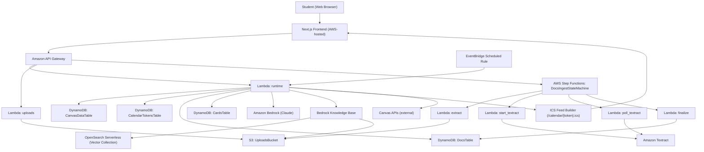

# StudyBuddy Architecture (AWS Demo)

This document explains how the StudyBuddy system is intended to work end-to-end on AWS, combining the current implementation with the finalized hackathon demo target described in:

- `docs/OVERVIEW.md`
- `docs/ROADMAP.md`
- `docs/POST_HACKATHON_ROADMAP.md`

## Scope and framing

- **Current provisioned backend architecture:** API Gateway + Lambda + DynamoDB + S3 + Step Functions + EventBridge + Bedrock Knowledge Base + OpenSearch Serverless + Textract.
- **Finalized hackathon demo target:** complete user flow from Canvas sync -> docs ingest -> generate -> study -> calendar subscription, with deterministic fallback modes where explicitly enabled for demo resilience.
- **Out of scope for hackathon:** production auth/multi-user hardening and deeper reliability controls (tracked in post-hackathon roadmap).

## AWS services and responsibilities

- **Amazon API Gateway**
  - Public HTTP API surface for StudyBuddy endpoints.
  - Routes to Lambda handlers for runtime, uploads, ingest status, generation, study, and calendar.

- **AWS Lambda**
  - `backend.runtime.lambda_handler`: core app runtime (`/canvas/*`, `/courses*`, `/generate/*`, `/study/*`, `/calendar/*`, `/docs/ingest*` control plane).
  - `backend.uploads.lambda_handler`: upload flow for `POST /uploads`.
  - Ingest workflow lambdas: extract, Textract start/poll, finalize.

- **Amazon DynamoDB**
  - `CanvasDataTable`: Canvas connection + normalized course/item schedule rows.
  - `CalendarTokensTable`: token -> user mapping for private ICS feed access.
  - `DocsTable`: ingest and document metadata.
  - `CardsTable`: generated card state and related study data.

- **Amazon S3**
  - Upload bucket for source materials (syllabi, slides, notes, scanned docs).
  - Read by ingest workflow and Bedrock KB data source.

- **AWS Step Functions**
  - Orchestrates docs ingest (`POST /docs/ingest` + `GET /docs/ingest/{jobId}`).
  - Branches between fast-path extraction and OCR fallback.

- **Amazon Textract**
  - OCR fallback when PDF text extraction returns insufficient text.

- **Amazon EventBridge**
  - Scheduled Canvas sync trigger (default cadence: every 24 hours).
  - Keeps Canvas-backed schedule data fresh for timeline + ICS.

- **Amazon Bedrock**
  - Model inference for generation and chat.
  - Retrieval via Bedrock Knowledge Base.

- **Amazon Bedrock Knowledge Base + Amazon OpenSearch Serverless**
  - Vectorized retrieval over uploaded course content.
  - S3-backed KB data source with chunking and embedding configured in CDK.

- **Frontend on AWS (target deployment)**
  - Next.js web client deployed on AWS-managed hosting (service choice to be finalized in deployment decisions).
  - Calls API Gateway using `NEXT_PUBLIC_API_BASE_URL`.

## End-to-end architecture (finalized demo target)

## Core runtime flows

### 1) Canvas sync and schedule storage

1. Frontend calls `POST /canvas/connect` then `POST /canvas/sync`.
2. Runtime fetches Canvas courses/items and normalizes them into DynamoDB (`CanvasDataTable`).
3. `GET /courses` and `GET /courses/{courseId}/items` read from stored rows.
4. EventBridge periodically re-runs sync to keep deadlines current.

### 2) Docs ingestion and retrieval readiness

1. Frontend calls `POST /uploads` and uploads file to S3.
2. Frontend starts ingest via `POST /docs/ingest`; Step Functions executes extract flow.
3. If extracted text is insufficient, workflow falls back to async Textract OCR.
4. Finalize step writes ingest metadata/status to `DocsTable`.
5. Bedrock KB data source uses S3 content for retrieval during generation/chat.

### 3) Generation + study loop

1. Frontend calls generation endpoints (`/generate/flashcards`, `/generate/practice-exam`, `/chat`).
2. Runtime invokes Bedrock and retrieval against Knowledge Base.
3. Study endpoints (`/study/today`, `/study/review`, `/study/mastery`) read/write cards and review state in DynamoDB.
4. Mastery and review updates feed the UI loop.

### 4) Calendar subscription

1. Frontend requests token (`POST /calendar/token`).
2. Runtime stores token metadata in `CalendarTokensTable`.
3. Calendar client pulls `GET /calendar/{token}.ics`.
4. ICS content is generated from user schedule rows (with optional demo fallback when explicitly enabled).

## Current vs finalized demo (delta from roadmap)

- **Already in place**
  - CDK split stacks for data, API, and knowledge base.
  - API surface scaffolded in API Gateway/Lambda.
  - EventBridge scheduled Canvas sync trigger.
  - Step Functions ingest with Textract fallback path.
  - Bedrock KB infrastructure and retrieval permissions.

- **Needed to complete finalized hackathon demo**
  - Ensure Canvas sync write path fully drives real schedule rows used by ICS and timeline.
  - Close loop from docs ingest completion to reliable KB ingestion job trigger (currently manual in roadmap notes).
  - Finish wiring study/generation endpoints from scaffold behavior to runtime-backed FSRS/mastery flows.
  - Finalize frontend deployment path on AWS and wire live API base URL for end-to-end demo.

- **Post-hackathon hardening (not demo blockers)**
  - Strong auth/multi-user, token encryption/rotation, retry/DLQ/alerts, deeper ingestion quality controls.

## Notes for maintainers

- Treat `docs/OVERVIEW.md` as product/architecture source of truth and keep this document synchronized when architecture decisions change.
- Keep API behavior contract-first (`contracts/openapi.yaml` + schemas/examples) as runtime wiring evolves.
