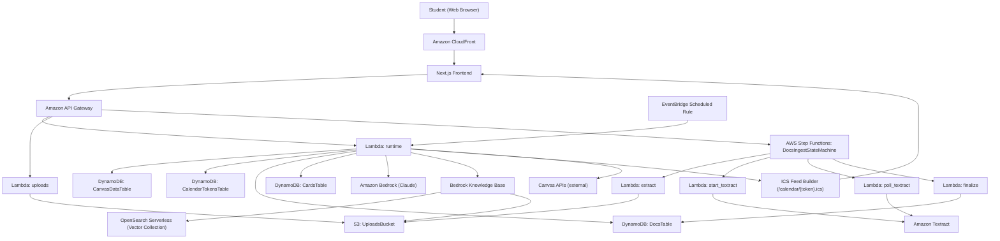

# StudyBuddy Architecture (Final Project on AWS)

This document explains how the StudyBuddy system works end-to-end on AWS in the current final project state:

- `docs/OVERVIEW.md`
- `docs/ROADMAP.md` (current-state status)

## Scope and framing

- **Current deployed architecture:** CloudFront-hosted web frontend + API Gateway + Lambda + DynamoDB + S3 + Step Functions + EventBridge + Bedrock Knowledge Base + OpenSearch Serverless + Textract.
- **Current demo flow coverage:** Canvas sync -> docs ingest -> generation/chat -> study loop -> calendar subscription.
- **Out of scope for hackathon:** full production auth/multi-user hardening and deeper reliability controls.

## AWS services and responsibilities

- **Amazon API Gateway**
  - Public HTTP API surface for StudyBuddy endpoints.
  - Routes to Lambda handlers for runtime, uploads, ingest status, generation, study, and calendar.

- **AWS Lambda**
  - `backend.runtime.lambda_handler`: core app runtime (`/canvas/*`, `/courses*`, `/generate/*`, `/study/*`, `/calendar/*`, `/docs/ingest*` control plane).
  - `backend.uploads.lambda_handler`: upload flow for `POST /uploads`.
  - Ingest workflow lambdas: extract, Textract start/poll, finalize.

- **Amazon DynamoDB**
  - `CanvasDataTable`: Canvas connection + normalized course/item schedule rows.
  - `CalendarTokensTable`: token -> user mapping for private ICS feed access.
  - `DocsTable`: ingest and document metadata.
  - `CardsTable`: generated card state and related study data.

- **Amazon S3**
  - Upload bucket for source materials (syllabi, slides, notes, scanned docs).
  - Read by ingest workflow and Bedrock KB data source.

- **AWS Step Functions**
  - Orchestrates docs ingest (`POST /docs/ingest` + `GET /docs/ingest/{jobId}`).
  - Branches between fast-path extraction and OCR fallback.

- **Amazon Textract**
  - OCR fallback when PDF text extraction returns insufficient text.

- **Amazon EventBridge**
  - Scheduled Canvas sync trigger (default cadence: every 24 hours).
  - Keeps Canvas-backed schedule data fresh for timeline + ICS.

- **Amazon Bedrock**
  - Model inference for generation and chat.
  - Retrieval via Bedrock Knowledge Base.

- **Amazon Bedrock Knowledge Base + Amazon OpenSearch Serverless**
  - Vectorized retrieval over uploaded course content.
  - S3-backed KB data source with chunking and embedding configured in CDK.

- **Amazon CloudFront (frontend delivery)**
  - Public entry point for the web app.
  - Serves the deployed frontend bundle and routes browser requests to the app origin.

- **Frontend app**
  - Next.js web client deployed behind CloudFront.
  - Calls API Gateway using `NEXT_PUBLIC_API_BASE_URL`.

## End-to-end architecture (current final state)

## Core runtime flows

### 1) Canvas sync and schedule storage

1. Frontend calls `POST /canvas/connect` then `POST /canvas/sync`.
2. Runtime fetches Canvas courses/items and normalizes them into DynamoDB (`CanvasDataTable`).
3. `GET /courses` and `GET /courses/{courseId}/items` read from stored rows.
4. EventBridge periodically re-runs sync to keep deadlines current.

### 2) Docs ingestion and retrieval readiness

1. Frontend calls `POST /uploads` and uploads file to S3.
2. Frontend starts ingest via `POST /docs/ingest`; Step Functions executes extract flow.
3. If extracted text is insufficient, workflow falls back to async Textract OCR.
4. Finalize step writes ingest metadata/status to `DocsTable`.
5. Bedrock KB data source uses S3 content for retrieval during generation/chat.

### 3) Generation + study loop

1. Frontend calls generation endpoints (`/generate/flashcards`, `/generate/practice-exam`, `/chat`).
2. Runtime invokes Bedrock and retrieval against Knowledge Base.
3. Study endpoints (`/study/today`, `/study/review`, `/study/mastery`) read/write cards and review state in DynamoDB.
4. Mastery and review updates feed the UI loop.

### 4) Calendar subscription

1. Frontend requests token (`POST /calendar/token`).
2. Runtime stores token metadata in `CalendarTokensTable`.
3. Calendar client pulls `GET /calendar/{token}.ics`.
4. ICS content is generated from user schedule rows (with optional demo fallback when explicitly enabled).

## Current status snapshot

- Frontend is deployed on CloudFront and calls the API Gateway stage configured in `NEXT_PUBLIC_API_BASE_URL`.
- Runtime endpoints for Canvas, uploads/ingest, generation/chat, study, and calendar are live.
- EventBridge scheduled Canvas sync and tokenized ICS feed are part of the deployed architecture.
- Bedrock KB retrieval stack is active with OpenSearch Serverless vector storage.
- Demo safety fallback behavior remains available where explicitly enabled by environment flags.

## Notes for maintainers

- Treat `docs/OVERVIEW.md` as product/architecture source of truth and keep this document synchronized when architecture decisions change.
- Keep API behavior contract-first (`contracts/openapi.yaml` + schemas/examples) as runtime wiring evolves.
