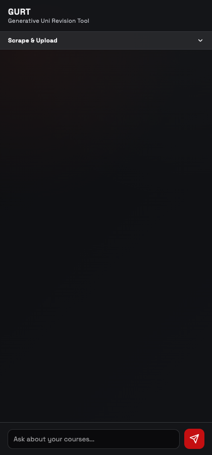
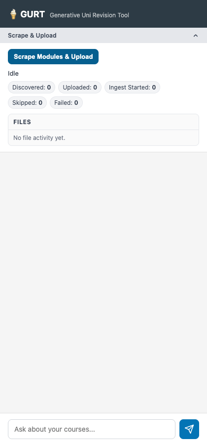
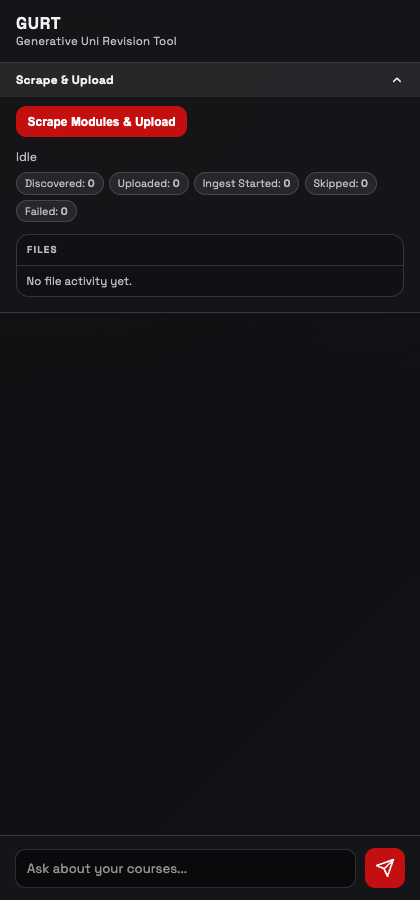
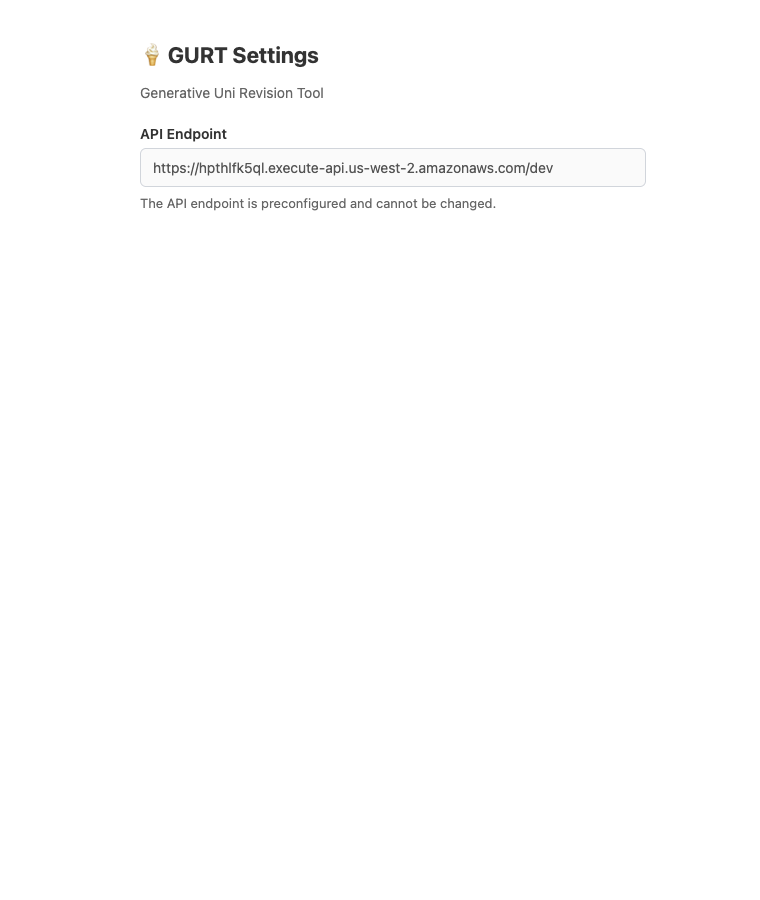
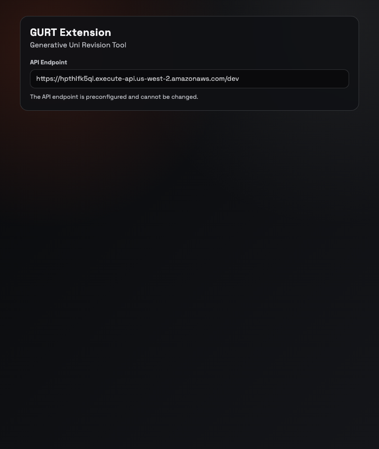

# Issue #99 Extension UI Parity QA

This document captures visual before/after evidence for the browser extension UI parity update.

## Scope

- Updated extension styling to match the web app visual language (typography, spacing, buttons, status states, and action surfaces).
- Preserved existing sidepanel and options functionality.

## Manual QA Screenshots

### Sidepanel (collapsed state)

Before:

After:

### Sidepanel (scrape drawer expanded)

Before:

After:

### Options page

Before:

After:

## Manual QA Notes

- Loaded `browserextention/sidepanel.html` and `browserextention/options.html` via local HTTP server.
- Verified sidepanel renders updated visual treatment.
- Verified scrape drawer toggle still expands/collapses.
- Verified compose input and send button still render with existing IDs and hooks.
- Verified options page content remains read-only and endpoint text remains unchanged.
